# PrepOS - AI-Powered CAT Exam Preparation Platform

<div align="center">


**Intelligent exam preparation with multi-agent AI analysis**

</div>

---

## Table of Contents

- [Overview](#overview)
- [Architecture](#architecture)
- [Features](#features)
- [Tech Stack](#tech-stack)
- [Quick Start](#quick-start)
- [Detailed Setup](#detailed-setup)
  - [Linux/macOS](#linuxmacos-setup)
  - [Windows](#windows-setup)
- [Project Structure](#project-structure)
- [API Documentation](#api-documentation)
- [AI Agents](#ai-agents)
- [License](#license)

---

## Overview

PrepOS is an AI-powered preparation platform exclusively designed for CAT (Common Admission Test) aspirants. It leverages a multi-agent AI system built on Google Gemini to provide personalized learning experiences, intelligent test analysis, and adaptive study roadmaps.

---

## Architecture

```
┌─────────────────────────────────────────────────────────────────────────────┐
│                              PREPOS ARCHITECTURE                             │
└─────────────────────────────────────────────────────────────────────────────┘

┌─────────────────────────────────────────────────────────────────────────────┐
│                                 CLIENT LAYER                                 │
│  ┌─────────────┐  ┌─────────────┐  ┌─────────────┐  ┌─────────────────────┐ │
│  │  Dashboard  │  │  Mock Test  │  │  Analysis   │  │  AI Agent Swarm     │ │
│  │    Page     │  │    Page     │  │    Page     │  │       Page          │ │
│  └──────┬──────┘  └──────┬──────┘  └──────┬──────┘  └──────────┬──────────┘ │
│         │                │                │                     │            │
│  ┌──────┴────────────────┴────────────────┴─────────────────────┴──────────┐│
│  │                        React 18 + React Router                          ││
│  │                     Service Layer (API Client + Auth)                   ││
│  └─────────────────────────────────┬───────────────────────────────────────┘│
└────────────────────────────────────│────────────────────────────────────────┘
                                     │ HTTP/REST
                                     ▼
┌─────────────────────────────────────────────────────────────────────────────┐
│                                 API GATEWAY                                  │
│  ┌─────────────────────────────────────────────────────────────────────────┐│
│  │                    FastAPI (Uvicorn ASGI Server)                        ││
│  │                         Port 3001                                        ││
│  └─────────────────────────────────┬───────────────────────────────────────┘│
│                                    │                                         │
│  ┌──────────────┬──────────────────┼──────────────────┬───────────────────┐ │
│  │              │                  │                  │                   │ │
│  ▼              ▼                  ▼                  ▼                   │ │
│ /auth        /tests            /agents           /students               │ │
│ Routes       Routes            Routes            Routes                   │ │
└──────────────────────────────────────────────────────────────────────────────┘
                                     │
                                     ▼
┌─────────────────────────────────────────────────────────────────────────────┐
│                              AI AGENT LAYER                                  │
│                                                                              │
│  ┌───────────────┐  ┌───────────────┐  ┌───────────────┐  ┌──────────────┐ │
│  │   ARCHITECT   │  │   DETECTIVE   │  │    TUTOR      │  │  STRATEGIST  │ │
│  │               │  │               │  │               │  │              │ │
│  │  Generates    │  │  Analyzes     │  │  Provides     │  │  Creates     │ │
│  │  Personalized │  │  Mistakes &   │  │  Socratic     │  │  Personalized│ │
│  │  Questions    │  │  Patterns     │  │  Explanations │  │  Roadmaps    │ │
│  │               │  │               │  │               │  │              │ │
│  │ gemini-2.5-pro│  │gemini-2.5-flash│ │ gemini-2.5-pro│  │gemini-2.5-flash│
│  └───────┬───────┘  └───────┬───────┘  └───────┬───────┘  └──────┬───────┘ │
│          │                  │                  │                 │          │
│  ┌───────┴──────────────────┴──────────────────┴─────────────────┴───────┐  │
│  │                        Gemini Client                                   │  │
│  │            (Rate Limiting, Retry Logic, Error Handling)               │  │
│  └───────────────────────────────────┬───────────────────────────────────┘  │
└──────────────────────────────────────│──────────────────────────────────────┘
                                       │
                                       ▼
                            ┌─────────────────────┐
                            │   Google Gemini API │
                            │    (Cloud AI)       │
                            └─────────────────────┘

┌─────────────────────────────────────────────────────────────────────────────┐
│                              DATA LAYER                                      │
│  ┌─────────────────────────────────────────────────────────────────────────┐│
│  │                         MongoDB (Motor Async)                           ││
│  │                                                                          ││
│  │  ┌──────────┐  ┌──────────┐  ┌──────────┐  ┌──────────┐  ┌──────────┐  ││
│  │  │  users   │  │  tests   │  │questions │  │ attempts │  │ roadmaps │  ││
│  │  └──────────┘  └──────────┘  └──────────┘  └──────────┘  └──────────┘  ││
│  └─────────────────────────────────────────────────────────────────────────┘│
└─────────────────────────────────────────────────────────────────────────────┘

┌─────────────────────────────────────────────────────────────────────────────┐
│                           AUTHENTICATION FLOW                                │
│                                                                              │
│  User ──► Login Page ──► Google OAuth 2.0 ──► JWT Token ──► Protected Routes│
│                                                                              │
└─────────────────────────────────────────────────────────────────────────────┘
```

---

## Features

- **Multi-Agent AI System** - Four specialized agents for comprehensive analysis
- **CAT Mock Tests** - Full-length and sectional tests with real exam patterns
- **Performance Analytics** - Section-wise and topic-wise performance tracking
- **Personalized Roadmap** - AI-generated study plans based on weaknesses
- **Google OAuth** - Secure authentication with Google accounts
- **Premium Dark UI** - Modern, responsive interface optimized for focus

---

## Screenshots

### Dashboard
The main dashboard showing your performance overview and quick actions.

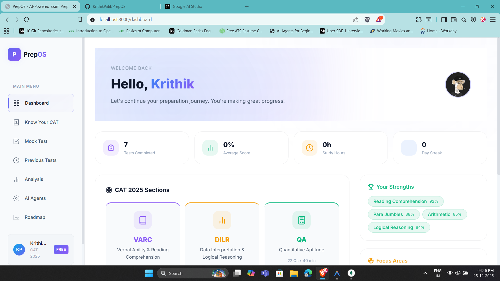

### Mock Tests
Browse and start practice tests organized by section and difficulty.

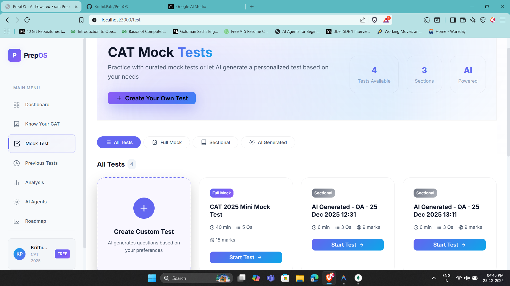

### Test Interface
Clean, distraction-free test-taking environment with timer and navigation.

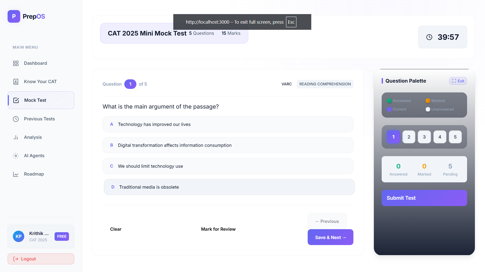

### Previous Tests
View your test history with scores, percentiles, and AI analysis access.

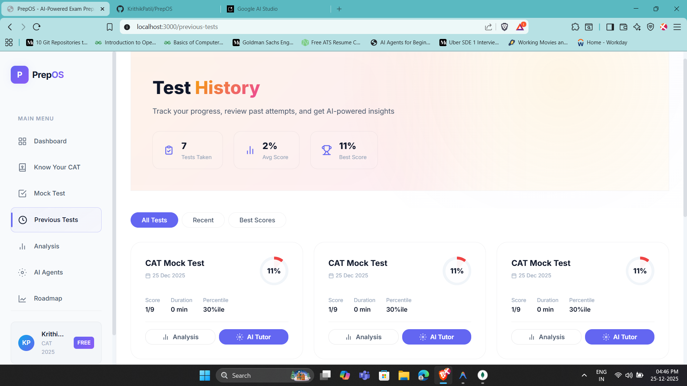

### AI Analysis
Deep dive into your performance with the Detective Agent's mistake analysis.

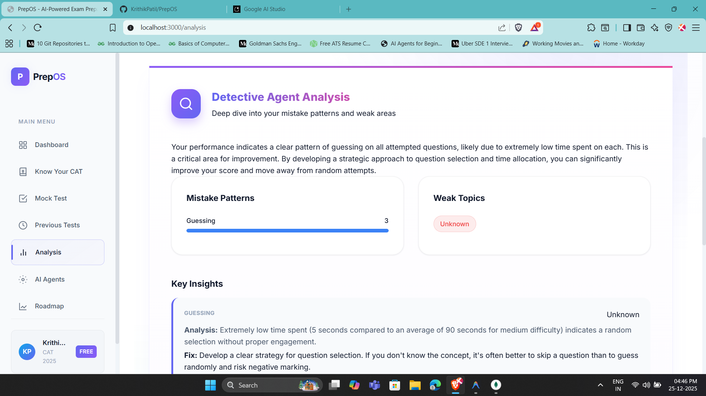

### AI Tutor
Interactive per-question tutoring with pre-generated insights and chat.

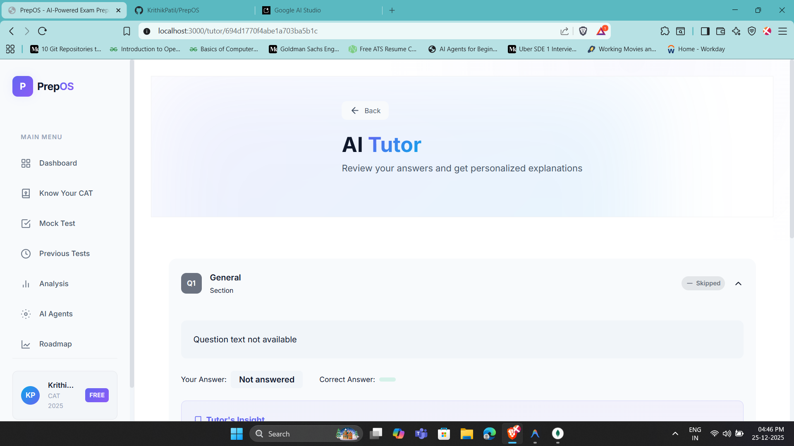

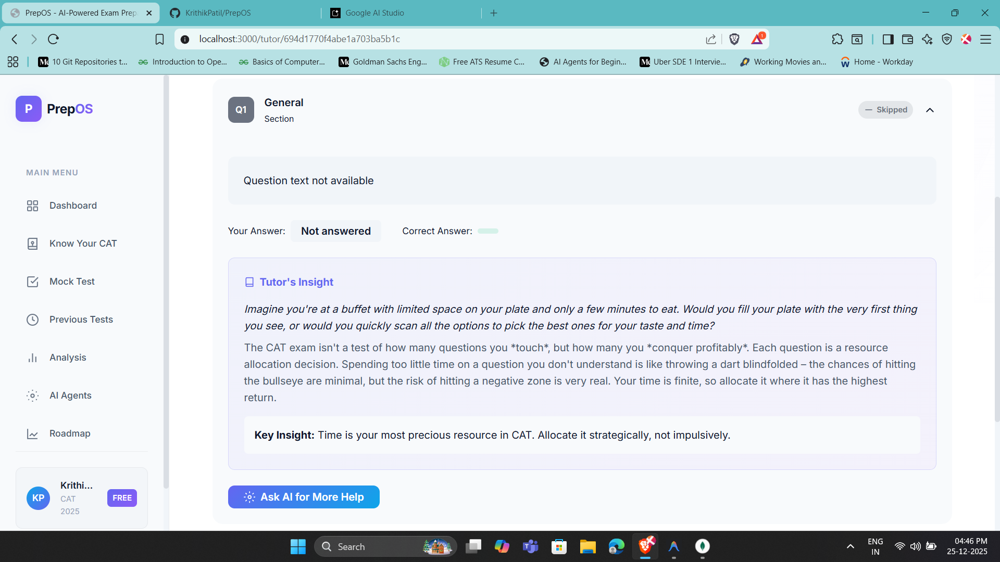

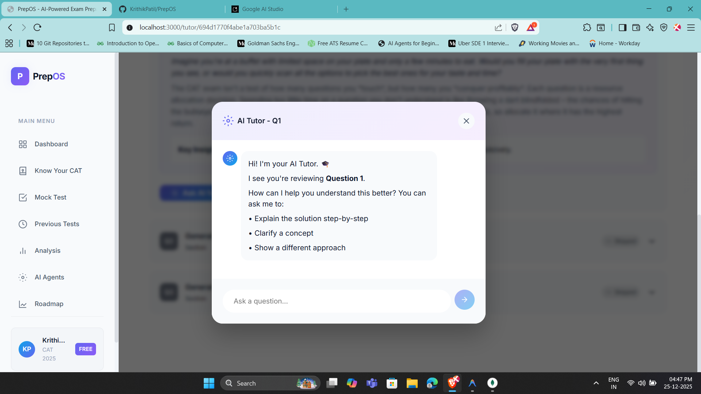

### Study Roadmap
Your personalized weekly study plan generated by the Strategist Agent.

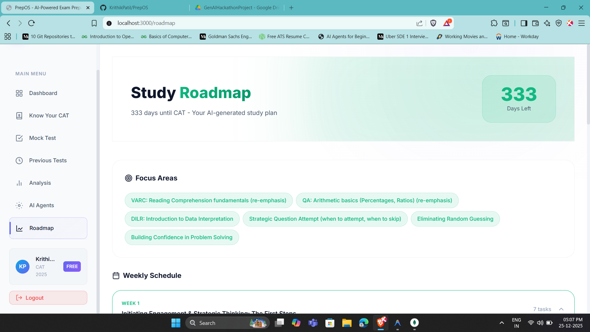

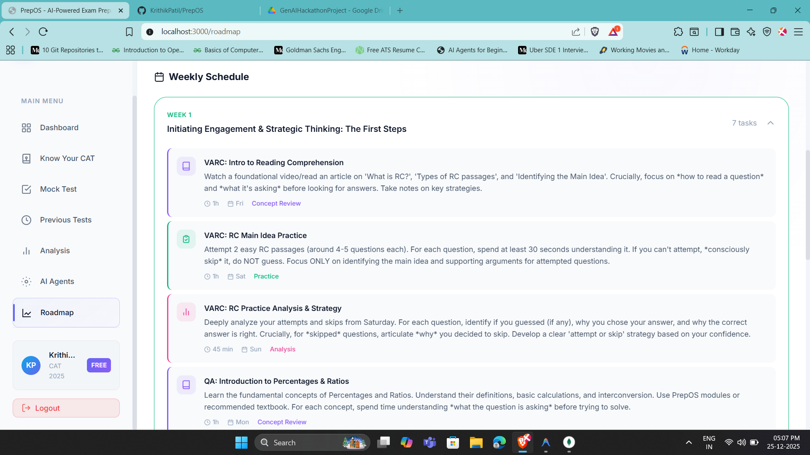

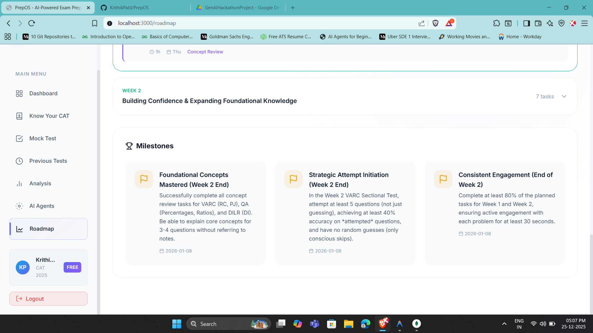

## Tech Stack

| Layer | Technology |
|-------|------------|
| Frontend | React 18, CSS3, React Router |
| Backend | Python 3.11+, FastAPI, Uvicorn |
| Database | MongoDB 7.x with Motor (async) |
| AI | Google Gemini (gemini-2.5-pro, gemini-2.5-flash) |
| Auth | Google OAuth 2.0, JWT (python-jose) |

---

## Quick Start

```bash
# Clone the repository
git clone https://github.com/KrithikPatil/PrepOS.git
cd PrepOS

# Install frontend dependencies
npm install

# Setup backend
cd server
python -m venv venv
source venv/bin/activate  # Linux/macOS
pip install -r requirements.txt

# Configure environment
cp .env.example .env
# Edit .env with your API keys

# Start servers
cd ..
npm start &
cd server && python -m uvicorn main:app --port 3001
```

---

## Detailed Setup

### Prerequisites

- Node.js 18.x or higher
- Python 3.11 or higher
- MongoDB 7.x (local or Atlas)
- Git

---

### Linux/macOS Setup

#### 1. Install Prerequisites

```bash
# Ubuntu/Debian
sudo apt update
sudo apt install nodejs npm python3 python3-pip python3-venv mongodb-org git

# macOS (with Homebrew)
brew install node python@3.11 mongodb-community git
```

#### 2. Clone Repository

```bash
git clone https://github.com/KrithikPatil/PrepOS.git
cd PrepOS
```

#### 3. Setup Frontend

```bash
npm install
```

#### 4. Setup Backend

```bash
cd server
python3 -m venv venv
source venv/bin/activate
pip install -r requirements.txt
```

#### 5. Configure Environment

```bash
cp .env.example .env
nano .env
```

Required variables in `server/.env`:

```env
MONGODB_URI=mongodb://localhost:27017
JWT_SECRET=your-secret-key-here
GEMINI_API_KEY=your-gemini-api-key
GOOGLE_CLIENT_ID=your-client-id
GOOGLE_CLIENT_SECRET=your-client-secret
GOOGLE_REDIRECT_URI=http://localhost:3001/api/auth/google/callback
FRONTEND_URL=http://localhost:3000
```

#### 6. Start MongoDB

```bash
# Linux
sudo systemctl start mongod

# macOS
brew services start mongodb-community
```

#### 7. Run Database Migration

```bash
cd server
source venv/bin/activate
python -m db.migrate
```

#### 8. Start Servers

Terminal 1 (Backend):
```bash
cd PrepOS/server
source venv/bin/activate
python -m uvicorn main:app --host 0.0.0.0 --port 3001 --reload
```

Terminal 2 (Frontend):
```bash
cd PrepOS
npm start
```

#### 9. Access Application

- Frontend: http://localhost:3000
- Backend API: http://localhost:3001/api
- API Docs: http://localhost:3001/docs

---

### Windows Setup

#### 1. Install Prerequisites

Using Chocolatey (recommended):
```powershell
# Install Chocolatey (Run PowerShell as Admin)
Set-ExecutionPolicy Bypass -Scope Process -Force
iex ((New-Object System.Net.WebClient).DownloadString('https://chocolatey.org/install.ps1'))

# Install dependencies
choco install nodejs python311 mongodb git -y
```

Manual installation:
- Node.js: https://nodejs.org/
- Python 3.11: https://www.python.org/downloads/
- MongoDB: https://www.mongodb.com/try/download/community
- Git: https://git-scm.com/download/win

#### 2. Clone Repository

```powershell
git clone https://github.com/KrithikPatil/PrepOS.git
cd PrepOS
```

#### 3. Setup Frontend

```powershell
npm install
```

#### 4. Setup Backend

```powershell
cd server
python -m venv venv
.\venv\Scripts\activate
pip install -r requirements.txt
```

#### 5. Configure Environment

```powershell
copy .env.example .env
notepad .env
```

#### 6. Run Database Migration

```powershell
cd server
.\venv\Scripts\activate
python -m db.migrate
```

#### 7. Start Servers

Terminal 1 (Backend):
```powershell
cd PrepOS\server
.\venv\Scripts\activate
python -m uvicorn main:app --host 0.0.0.0 --port 3001 --reload
```

Terminal 2 (Frontend):
```powershell
cd PrepOS
npm start
```

---

## Project Structure

```
PrepOS/
├── public/                 # Static assets
├── src/                    # React frontend
│   ├── components/         # Reusable UI components
│   ├── contexts/           # React contexts (Auth, Theme)
│   ├── pages/              # Page components
│   ├── services/           # API service layer
│   └── hooks/              # Custom React hooks
├── server/                 # Python backend
│   ├── agents/             # AI agents (Architect, Detective, etc.)
│   ├── api/routes/         # FastAPI route handlers
│   ├── config/             # App configuration
│   └── db/                 # Database models and migrations
├── .env.example            # Environment template
└── README.md               # Documentation
```

---

## API Documentation

| Endpoint | Method | Description |
|----------|--------|-------------|
| `/api/auth/google` | GET | Initiate Google OAuth flow |
| `/api/auth/dev-login` | POST | Development login (debug mode only) |
| `/api/tests/` | GET | List available tests |
| `/api/tests/{id}` | GET | Get test with questions |
| `/api/tests/{id}/submit` | POST | Submit test answers |
| `/api/agents/analyze` | POST | Start AI analysis job |
| `/api/agents/status/{job_id}` | GET | Get analysis status |
| `/api/students/profile` | GET | Get user profile |
| `/api/students/attempts` | GET | Get test attempt history |
| `/api/students/roadmap` | GET | Get personalized roadmap |

Interactive API documentation available at: http://localhost:3001/docs

---

## AI Agents

| Agent | Model | Purpose |
|-------|-------|---------|
| Architect | gemini-2.5-pro | Generates personalized practice questions targeting weak areas |
| Detective | gemini-2.5-flash | Analyzes mistake patterns and time management issues |
| Tutor | gemini-2.5-pro | Provides Socratic-style explanations for conceptual clarity |
| Strategist | gemini-2.5-flash | Creates week-by-week personalized study roadmaps |

---

## Getting API Keys

### Gemini API Key
1. Visit https://aistudio.google.com/apikey
2. Create a new API key
3. Add to `server/.env` as `GEMINI_API_KEY`

### Google OAuth Credentials
1. Go to https://console.cloud.google.com/
2. Create a new project
3. Enable Google+ API
4. Create OAuth 2.0 credentials
5. Add client ID and secret to `server/.env`

---

## License

MIT License - see [LICENSE](LICENSE) for details.

---

<div align="center">
PrepOS - Intelligent CAT Preparation
</div>
